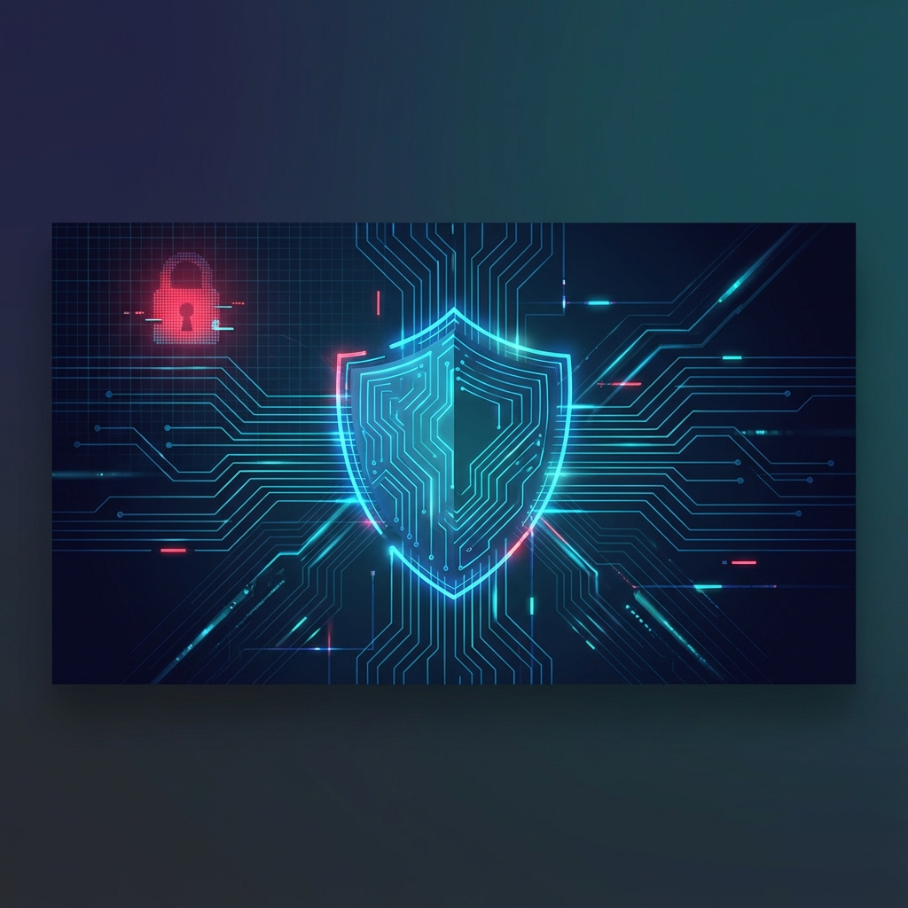

# Zelyo Config Guardian - Test Environment

> **Status:** Vulnerable by Design ⚠️
> **Purpose:** Validation of Zelyo Agent's detection and remediation capabilities.

This repository hosts a set of intentionally insecure Kubernetes manifests and Helm charts. It serves as a sandbox for testing **Zelyo Config Guardian**, an AI-powered security operator that scans clusters, identifies risks, and automatically generates GitOps-native fixes via Pull Requests.

---

## 🏗️ Architecture


The workflow demonstrates a closed-loop security automation cycle:
1. **Deploy:** ArgoCD syncs this repo's `master` (or feature) branch to the cluster.
2. **Scan:** Zelyo Agent scans the cluster and identifies misconfigurations.
3. **Remediate:** Zelyo uses LLMs to generate a fix and opens a **Pull Request**.
4. **Learn:** Anonymized data from the process builds Zelyo's shared intelligence.

---

## 🎯 Intentionally Vulnerable Resources

We have planted specific security and configuration flaws to verify Zelyo's catch rate.

### 1. The "Vulnerable App" (`charts/vulnerable-app`)
A web application deployment with critical security gaps.

| Risk Level | Issue | Description |
|------------|-------|-------------|
| 🔴 **Critical** | **Privileged Container** | Container runs with `--privileged` flag. |
| 🔴 **Critical** | **Run as Root** | No security context to force non-root user. |
| 🟠 **High** | **No Resource Limits** | CPU/Memory unbounded, risking node starvation. |
| 🟠 **High** | **Auto-mount SA Token** | Service Account token mounted unnecessarily. |
| 🟡 **Medium** | **No Network Policy** | Unrestricted internal traffic flow. |

### 2. "Insecure RBAC" (`apps/insecure-rbac`)
Role-based access controls that grant excessive permissions.

| Risk Level | Issue | Description |
|------------|-------|-------------|
| 🔴 **Critical** | **Wildcard ClusterRole** | `*` verbs on `*` resources (Cluster Admin equivalent). |
| 🔴 **Critical** | **Secrets Access** | Permission to `list/get` Secrets globally. |

---

## 🚀 Getting Started

### 1. Deploy with ArgoCD
Use the provided Application manifest to sync the vulnerable resources.

```bash
kubectl apply -f argocd/zelyo-test-app.yaml
```

### 2. Run Zelyo Scan
Trigger a scan from your Zelyo Agent instance.

```bash
curl -X POST http://localhost:8088/scan
```

### 3. Verify Remediation
Check this repository's Pull Requests. You should see incoming PRs from Zelyo with title format:
> **fix(C-0016): Remediate privileged container in vulnerable-app**

---

## 🛡️ Disclaimer
**DO NOT** deploy these manifests to a production cluster. They are designed to be exploitable for educational and testing purposes only.

---
*Maintained by the Zelyo AI Team for robustness testing.*
