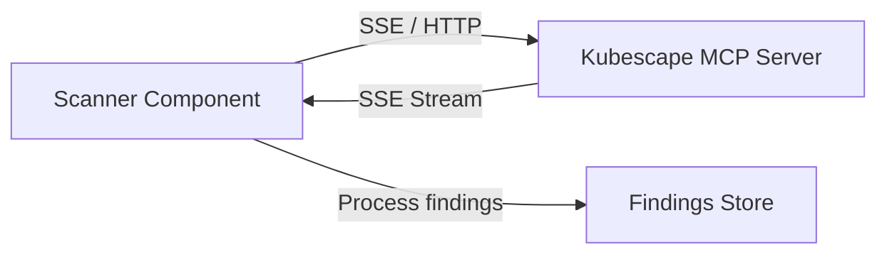

# Specification: Kubescape MCP Integration

## 1. Overview
This track replaces the current `subprocess` based execution of the Kubescape binary with a Model Context Protocol (MCP) integration. The application will connect to a Kubescape MCP server via Server-Sent Events (SSE) to fetch configuration hygiene findings in real-time.

## 2. Goals
- Implement an SSE client to maintain a connection with the Kubescape MCP server.
- Implement the MCP protocol handshake and message handling.
- Map MCP finding resources to the existing internal `Finding` domain model.
- Refactor the `POST /scan` logic to trigger MCP-based data retrieval.

## 3. Architecture

### 3.1 Component Diagram

### 3.2 Key Changes
- **`src/mcp_client.py`**: New module for SSE and MCP protocol logic.
- **`src/scanner.py`**: Refactor `run_scan()` to use `mcp_client`.
- **`src/parser.py`**: Update to handle MCP finding payloads (if different from current JSON).

## 4. Technical Requirements
- Use `httpx` for asynchronous SSE communication.
- Handle connection persistence, retries, and timeouts.
- Support Kubernetes context injection (kubeconfig) via the MCP connection configuration.

## 5. Non-Functional Requirements
- **Efficiency**: Reduce overhead of spawning local processes.
- **Real-time**: Capability to receive findings as they are detected by the MCP server.
